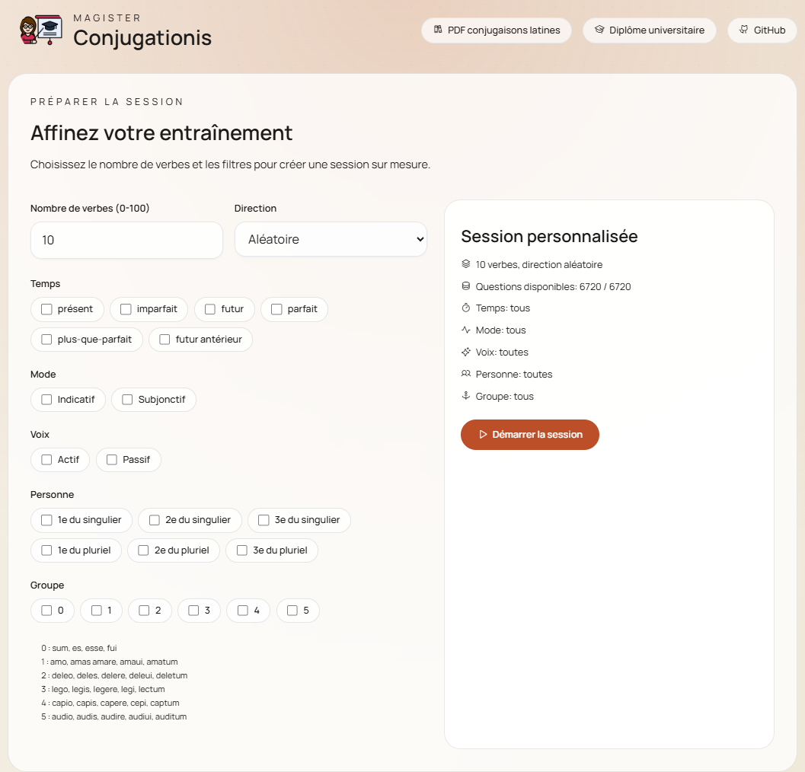

# MAGISTER CONJUGATIONIS : Entraînement à la conjugaison latine
Lien vers le site internet : https://crispyfunicular.github.io/magister_conjugationis/  
Ce site permet de s'entraîner aux conjugaisons latines en proposant des exercices personnalisables par temps, personne, voix, mode ou encore groupe de verbes. Amo, capiebantur, deleuissetis... l'apprentissage de la conjugaison latine devient un vrai jeu d'enfant !  



## Description
Ce programme permet de faire pratiquer les conjugaisons latines à l'utilisateurice de la façon suivante :
- Le programme peut afficher un verbe conjugué (ou forme fléchie) en latin, l'utilisateruice doit donner successivement les informations suivantes : personne, temps, voix, mode, traduction de l'infinitif. Exemple :
```
  Nouveau verbe à trouver : narrabamus
  Indiquer la personne (de 1 à 6) : 4
  Temps possibles : présent, imparfait, futur, parfait, plus-que-parfait ou futur antérieur : imparfait
  Indiquer la voix (actif ou passif) : actif
  Indiquer le mode (indicatif ou subjonctif) : indicatif
  Indiquer la traduction en français (à l'infinitif) : raconter
  Bravo !
```
- Le programme peut afficher les informations suivantes : personne, temps, voix, mode... et demander à l'utilisateur de fournir la forme fléchie correspondante en latin.
```
Indiquer la forme fléchie pour le(s) verbe(s) 'commencer', à la 3e personne du singulier, imparfait, passif, indicatif
incipiebatur
```

Si la réponse proposée n'est pas celle attendue, l'utilisateurice a la possibilité :
1. de tenter à nouveau sa chance ;
2. de voir les temps primitifs du verbe en question ; ou
3. de voir la réponse (auquel cas iel ne marquera aucun point pour la question).
```
Essayer à nouveau cette question (1), voir les temps primitifs (2) ou voir la réponse (3) ?
```

## Rappel concernant les conjugaisons latines
Le lemme de chaque verbe latin indique ses "**temps primitifs**", qui fournissent un certain nombre d'informations cruciales à son sujet, notamment le groupe verbal auquel il appartient. Ainsi, "o, as, are, aui, atum" indique de façon univoque qu'il s'agit d'un verbe du premier groupe.  
Les verbes latins sont en effet classés en groupes. Le programme utilise la classification suivante :
- (1) "o, as, are"
- (2) "eo, es, ere"
- (3) "o, is, ere"
- (4) "io, is, ere"
- (5) "io, is ire"
- (0) Pour les besoin du programme, la catégorie 0 correspond au verbe "esse" et à ses dérivés.

Les lettres "u" et "v" sont interchangeables, ainsi que "i" et "j" (le "v" et le "j" correspondant tous deux à une graphie tardive). Par conséquent, "amavi" est aussi valide qu'"amaui" et "jussi" est aussi valide que "iussi".  

Les formes verbales latines ne portant aucune marque de genre, "amat" peut aussi bien être traduit par "il aime" que par "elle aime". En revanche, "on aime" n'est pas pris en compte par le programme.  

Lorsqu'un verbe latin admet plusieurs traductions en français, n'importe laquelle de celles-ci est admise par le programme (p. ex. : "legere" = lire, ceuillir, choisir).


## NooJ : génération des formes fléchies
La richesse morphologique du latin est gérée grâce à NooJ, un outil de traitement automatique du langage naturel. Le cœur du système repose sur la séparation stricte entre le lexique (les racines) et la grammaire (les règles de flexion).

### Dictionnaire (.dic)
Chaque verbe est entré dans le dictionnaire avec deux racines distinctes, correspondant aux deux thèmes fondamentaux du système verbal latin :

- Theme=INF (**infectum**) : utilisé pour les temps suivants : présent, imparfait et futur actifs et passifs.
- Theme=PER (**perfectum**) : utilisé pour les temps suivants : parfait, plus-que-parfait et futur antérieur *actifs*.
- Theme=SUP (**supinum**) : utilisé pour les temps suivants : parfait, plus-que-parfait et futur antérieur *passifs*.

Exemple pour le verbe "amare" (aimer) :

```
am,amare,V+GP=1+Theme=INF+FLX=GP1_INF   # Racine "am-" pour l'infectum (INF)
amau,amare,V+GP=1+Theme=PER+FLX=GP1_PER # Racine "amau-" pour le perfectum (PER)
amat,amare,V+GP=1+Theme=SUP+FLX=GP1_SUP # Racine "amat-" pour le supinum (SUP)
```

### Grammaire flexionnelle (.nof)
Les formes conjuguées sont générées par des grammaires graphiques qui assemblent dynamiquement :
- Le thème verbal fourni par le dictionnaire.
- La voyelle thématique propre au groupe verbal (ex : "a" pour le 1er groupe, "e" pour le 2e...).
- Le suffixe temporel (ex: "ba" pour l'imparfait, "bi" pour le futur des 1er et 2e groupes...).
- La désinence personnelle (ex: "o" ou "m", "s", "t", "mus", "tis", "nt" pour les temps de l'actif).

Exemple de règle pour l'imparfait actif du 1er groupe : thème de l'infectum (**am**) + voyelle thématique (**a**) + suffixe temporel (**ba**) + désinence personnelle (**m**) -> **amabam**


## Installation de l'environnement
```bash
python -m venv venv
source venv/bin/activate
pip install -r requirements.txt
```

## Utilisation du programme

```
project/ $ python project.py --help
usage: project.py [-h] [-d {latin,français}] [-g {0,1,2,3,4,5}] [-p {0,1,2,3,4,5,6}] [-t {futur,futur antérieur,imparfait,parfait,plus-que-parfait,présent}] [-v {actif,passif}] [-m {indicatif,subjonctif}] [--debug]

Interroge l'utilisateur sur les verbes latins

options:
  -h, --help            show this help message and exit
  -d {latin,français}, --direction {latin,français}
                        latin : latin -> français ; français : français -> latin
  -g {0,1,2,3,4,5}, --groupe {0,1,2,3,4,5}
                        Le groupe verbal (ex: 1) que vous souhaitez réviser (0 correspond à "esse" et ses dérivés)
  -p {0,1,2,3,4,5,6}, --personne {0,1,2,3,4,5,6}
                        La personne (comprise entre 1 et 6) que vous souhaitez pratiquer
  -t {futur,futur antérieur,imparfait,parfait,plus-que-parfait,présent}, --temps {futur,futur antérieur,imparfait,parfait,plus-que-parfait,présent}
                        Le temps (ex: "présent") que vous souhaitez pratiquer
  -v {actif,passif}, --voix {actif,passif}
                        La voix (actif ou passif) que vous souhaitez pratiquer
  -m {indicatif,subjonctif}, --mode {indicatif,subjonctif}
                        Le mode (indicatif ou subjonctif) que vous souhaitez pratiquer
  --debug               activer le mode debug

Bonam fortunam!
```

```
project/ $ python project.py
Combien de verbes voulez-vous pratiquer (entre 1 et 10) ? 3
Nouveau verbe à trouver : aberas
Indiquer la personne (de 1 à 6) : 2
Bravo !
Temps possibles : présent, imparfait, futur, parfait, plus-que-parfait ou futur antérieur
Réponse : imparfait
Bravo !
Indiquer la voix (actif ou passif) : actif
Bravo !
Indiquer le mode (indicatif ou subjonctif) : indicatif
Bravo !
Indiquer la traduction en français (à l'infinitif) : être absent
Bravo !
Indiquer la forme fléchie pour le(s) verbe(s) 'rester', à la 1e personne du pluriel, parfait, passif, indicatif : ?
Mauvaise réponse ! Errare humanum est...
Essayer à nouveau cette question (1), voir les temps primitifs (2), voir le lemme (3) ou voir la réponse (4) ? 2
Voici les temps primitifs : eo, es, ere, mansi, mansum
Indiquer la forme fléchie pour le(s) verbe(s) 'rester', à la 1e personne du pluriel, parfait, passif, indicatif : mansi sumus
Bravo !
Nouveau verbe à trouver : mittentur
Indiquer la personne (de 1 à 6) : 6
Bravo !
Temps possibles : présent, imparfait, futur, parfait, plus-que-parfait ou futur antérieur
Réponse : présent
Mauvaise réponse ! Errare humanum est...
Essayer à nouveau cette question (1), voir les temps primitifs (2) ou voir la réponse (3) ? 3
futur
Indiquer la voix (actif ou passif) : passif
Bravo !
Indiquer le mode (indicatif ou subjonctif) : indicatif
Bravo !
Indiquer la traduction en français (à l'infinitif) : ?
Mauvaise réponse ! Errare humanum est...
Essayer à nouveau cette question (1) ou voir la réponse (2) ? 2
envoyer
Score total : 2.6/3
Prêt-e pour une nouvelle partie ?
```

*Projet développé par Morgane Bona-Pellissier entre 2025 et 2026*